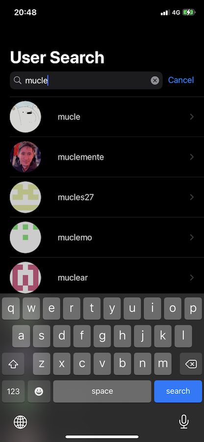
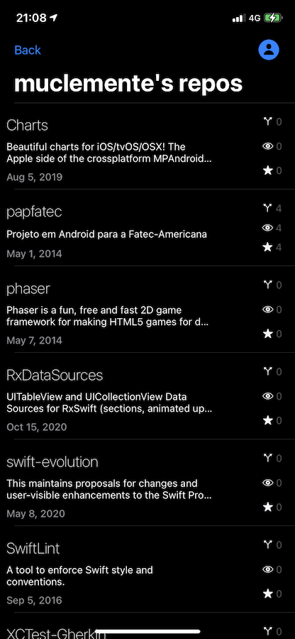

**Application Scope:**

GitHubBrowser is an iOS application that you can use to search for GitHub users, their repositories and profile stats;

I've used this project to learn a little about RxSwift and Reactive concepts;

**Concepts:**

- XcodeGen project generation to help with conflict mitigation in a team environment;
- Separate framework modules for isolating code and delitiming responsibilities/property accessors:
    - App: Main target with executable and initialization code;
    - Core: Reusable extensions, constants and mechanisms in the app;
    - Features: Presentation and business layer code;
    - Provider: Network access and abstractions for any data input;
- View Model/Rx/Coordinator patterns;
- Dependency injection pattern to help with test dependency mocking;
- ViewCode practices for better UI componentization;
- Unit tests using Mockolo to help with boilerplate code in the test project;

**Setup:**

- Uses GitHub's Personal Access token to authenticate. Setup this using the Makefile: 
`make user=muclemente token=XXX project`

**Features:**
- User search screen: lets you search for any GitHub user; You can search for usernames with more than 2 characters;

- Repository list: lists all public repositories for the selected user; Also lists the watchers, forks and stars from the repo;

- User profile: shows the public profile information from the selected user;

**Things to improve:**
- Implement pagination in searches;
- Hone in RX skills to make more advanced usage of the RX API (creating reactive components, better error treatment, etc)
- Add UITests for basic flow;
- Add cool transition animations ;)
- Add snapshot tests;